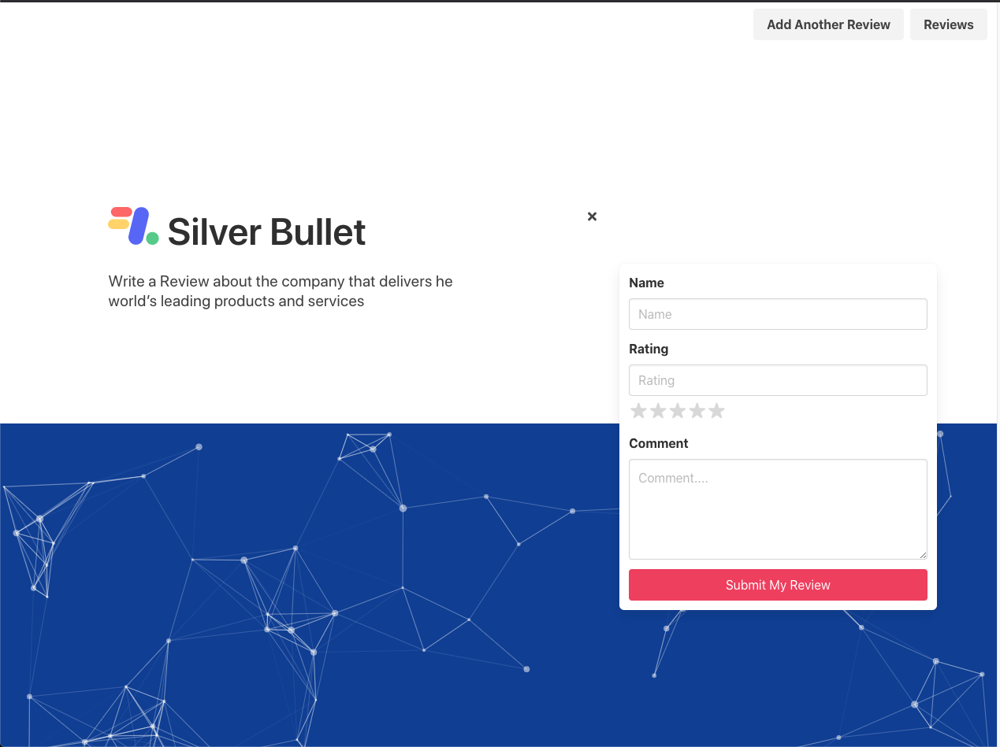

# silverBullet-test

## Getting Started
* Clone or download the repo.
* Install back-end dependencies: `pipenv`.
* Enter the project shell: `pipenv shell`.
* Make migrations: `python manage.py makemigrations`.
* Migrate: `python manage.py migrate`.
* Load seed data for Reviews: `python manage.py loaddata reviews/seeds.json`.
* Start back end server: `python manage.py runserver`.
* Install dependencies react in the client folder: `cd client && yarn`.
* Start the server (remaining in client folder): `yarn start`.
* create 2 terminals to start the back end server as well as the frontend

## Technologies Used
* React.js
* SASS
* React-Router-Dom
* Bulma CSS Framework
* Django
* Django REST framwork
* Postgre SQL

## Demonstration of Web Application

### Home Page 

### Review Form

### List of Reviews

### Top Reviews

## What I could of Done If I have more Time

* *Ratings*: I would of liked to remove the input for the ratings in the form and just leave the stars so when you click on the stars you wanted it updated the score value. Also I repeated code on the review form and the review list I could of exported it from one file to make my code more readable.
* *CreatedBy*: I would of liked to have utilised the created by property so that I could of showed the amount of time passed sinced reviewed. Also created a sort option to view most recent reviews on top.
* *Name*: I should of used the username property not the name property as username's can always be unique but names may not be.
* *Animations*: I would of loved to have animations for all pages and features especially for when the page loads.
